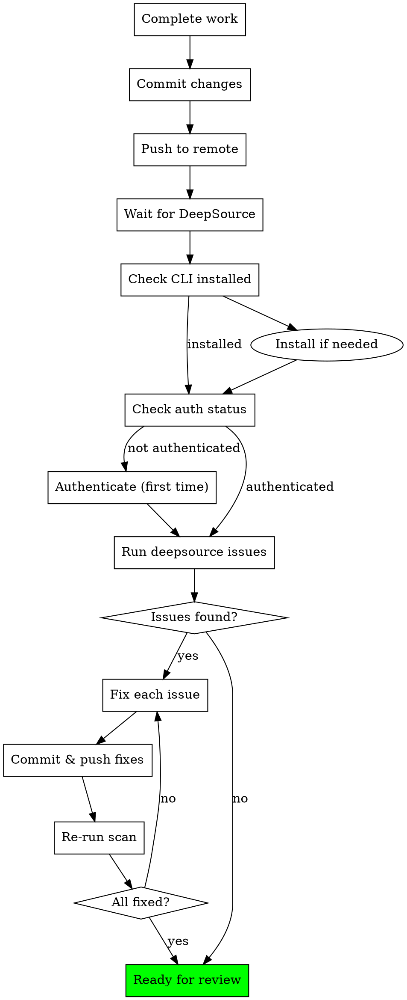

# DeepSource Check Skill

## Overview

MANDATORY: Run DeepSource CLI to scan code quality issues in your modified files AFTER committing and pushing changes to remote, or after creating a PR. This skill ensures all changes meet quality standards.

**Workflow:**

1. Complete your work and commit changes
2. Push to remote branch
3. Wait for DeepSource to analyze (or create PR)
4. Run this skill to check and fix issues
5. Commit and push fixes
6. Repeat until clean

## When to Use

- **AFTER committing and pushing changes to remote branch**
- **AFTER creating a pull request** (best - use `--pr` flag)
- Before requesting code review

## Core Process



## Step 1: Verify Installation

```bash
which deepsource
```

If not installed, install:

```bash
curl -fsSL https://cli.deepsource.com/install | sh
```

## Step 2: Check Authentication

```bash
deepsource auth status
```

**If NOT authenticated:**

- Tell the user: "DeepSource CLI is not authenticated. Please run `deepsource auth login` in a separate terminal to authenticate via browser. Let me know when done."
- Wait for user to confirm authentication is complete
- Verify: Run `deepsource auth status` again to confirm

**If authenticated:** Proceed to Step 3

## Step 3: Check Repository Activation

```bash
deepsource repo status
```

**If repo NOT activated:**

- Skip DeepSource check
- Warn user: "Repository not activated on DeepSource. Consider activating it for code quality tracking."

**If repo activated:** Proceed to Step 4

## Step 4: Checkout the Working Branch

**ALWAYS run deepsource from the branch you're working on, not from a detached HEAD or different branch.**

If you're in a detached HEAD state or the current branch differs from your work:

```bash
# Check current branch
git branch --show-current

# If detached or wrong branch, find your worktree
git worktree list

# cd to your worktree directory
cd /path/to/worktree
```

## Step 5: Scan for Issues

**CRITICAL: Run AFTER committing and pushing to remote branch.**

### Recommended: Use PR Number (Best)

If you've created a PR:

```bash
# Scan issues for a specific PR (BEST METHOD)
deepsource issues --pr <PR_NUMBER> --output json
```

### Alternative: Scan Branch

If no PR yet but branch is pushed:

```bash
# Basic scan - issues from your pushed branch
deepsource issues --output json
```

### Important: Branch Must Be Pushed

If you get error: "No analysis runs found for branch 'HEAD'"

This means the branch hasn't been analyzed yet. Options:

**Option A: Branch already pushed**

- The branch IS pushed but DeepSource hasn't analyzed the latest commit
- Wait a moment and try again, or check DeepSource dashboard

**Option B: Create a PR (recommended)**

- Create a PR on GitHub
- Then use: `deepsource issues --pr <PR_NUMBER> --output json`

**Option C: Scan default branch as reference ONLY (NOT for fixing)**

```bash
deepsource issues --default-branch --output json
# WARNING: Only use for reference, fix issues in YOUR branch
```

**DO NOT use --default-branch for fixing - only use your actual working branch or PR**

### Filter by Severity (priority order)

```bash
deepsource issues --severity critical --output json
deepsource issues --severity major --output json
deepsource issues --severity minor --output json
```

### Filter by Path (specific files)

```bash
deepsource issues --path backend/src/services/email.ts --output json
```

### Filter by Category

Categories: `anti-pattern`, `bug-risk`, `performance`, `security`, `style`, `documentation`

```bash
deepsource issues --category bug-risk --output json
deepsource issues --category security --output json
```

## Step 6: Parse and Fix Issues

### Understanding Output

JSON output contains:

```json
{
  "issues": [
    {
      "issue_code": "JS-033",
      "issue_title": "Unused variable",
      "description": "The variable 'foo' is assigned a value but never used",
      "severity": "major",
      "category": "bug-risk",
      "location": {
        "path": "backend/src/utils/helpers.ts",
        "lines": {
          "begin": 15,
          "end": 15
        }
      },
      "analyzer": "javascript"
    }
  ]
}
```

### Fix Each Issue

For each issue in modified files:

1. **Read the file** at the reported line
2. **Understand the problem** from the issue_title and description
3. **Check category** - security issues must be fixed, others prioritize
4. **Apply fix** following project conventions
5. **Document** if you must skip (add comment explaining why)

### Priority Order

Fix in this order:

1. **Critical** severity - Must fix
2. **Major** severity - Should fix
3. **Minor** severity - Nice to fix

### Categories to Watch

| Category      | Action                               |
| ------------- | ------------------------------------ |
| security      | MUST fix - potential vulnerabilities |
| bug-risk      | MUST fix - likely bugs               |
| anti-pattern  | SHOULD fix - poor code patterns      |
| performance   | SHOULD fix - performance issues      |
| style         | Nice to fix - code style             |
| documentation | Nice to fix - docs/comments          |

## Step 7: Commit and Push Fixes

After fixing issues:

```bash
# Commit your fixes
git add -A
git commit -m "fix: resolve deepsource issues"

# Push to trigger re-analysis
git push origin your-branch-name
```

## Step 8: Verify Fixes

Wait for DeepSource to re-analyze, then verify:

```bash
# Using PR (recommended)
deepsource issues --pr <PR_NUMBER> --output json

# Or using branch
deepsource issues --output json
```

Repeat until no issues remain.

## Project Analyzers

This project uses these DeepSource analyzers:

- JavaScript (with Vue plugin)
- SQL
- Secrets
- Docker
- Test Coverage

## ⚠️ CRITICAL: Prefer Real Fixes Over skipcq

**skipcq comments should be your LAST resort, not your first option.**

Before adding a skipcq comment, you MUST try to fix the issue properly:

### Priority Order

1. **First**: Actually fix the code issue (best solution)
2. **Second**: Refactor to satisfy the linter while keeping functionality
3. **Third**: Only if 1 and 2 are impossible → Add skipcq with detailed explanation

### When You MUST Fix Instead of Using skipcq

| Issue Type         | Fix Instead Of skipcq         |
| ------------------ | ----------------------------- |
| Unused variables   | Remove them or use `_` prefix |
| Unused imports     | Remove the import             |
| Type safety issues | Add proper null checks        |
| Complex functions  | Split into smaller functions  |
| Security issues    | MUST fix - never skip         |
| Bug-risk issues    | Fix the actual bug            |

### If You Can't Fix - Use Writing Plans Skill

If DeepSource reports issues that seem complex to fix:

1. **Use the brainstorming skill** to plan your approach:

```
Use skill: brainstorming
```

2. **Use the writing-plans skill** to create a detailed fix plan:

```
Use skill: writing-plans
```

3. Execute the plan to fix issues properly

**NEVER just add skipcq without attempting a real fix first.**

## Rules

**When to Add skipcq Comments:**

If an issue cannot be fixed for valid technical reasons, add a skipcq comment:

```typescript
// skipcq: JS-0339 - Explanation of why this is safe
const value = someValue as SomeType;
```

**Valid skipcq reasons:**

- Type assertion is safe due to external validation (database schema, API contract)
- Linter rule doesn't apply to this specific use case
- Code pattern is required by framework (e.g., Deno.serve async handler)

**No Exceptions Unless:**

1. Issue existed before your changes (pre-existing in original code)
2. Issue is in generated code (node_modules, dist/, etc.)
3. You've added an explanatory skipcq comment why the rule must be disabled
4. Repository is not activated on DeepSource

**Never:**

- Skip this check without verifying repo activation status
- Use `--no-verify` to bypass quality checks
- Leave critical/major issues in committed code
- Use --default-branch for fixing issues (must use your working branch)

## Red Flags

Stop and reconsider if:

- "I'll fix this later" → Fix now or it won't get fixed
- "It's just a style issue" → Style issues still matter for consistency
- "The analyzer is wrong" → Understand the issue first, then decide
- "Too many issues" → Fix them systematically, start with critical

## Example Session

```bash
# Step 1: Check installation
$ which deepsource
/home/user/.local/bin/deepsource

# Step 2: Check auth
$ deepsource auth status
Authenticated: Yes
User: developer@example.com

# Step 3: Check repo
$ deepsource repo status
Repository: ankaboot-source/leadminer
Status: Activated

# Step 4: Get modified files
$ git diff --name-only
backend/src/services/email.ts
backend/src/utils/helpers.ts

# Step 5: Scan issues
$ deepsource issues --output json | jq '.issues[] | select(.location.path | startswith("backend/"))'
{
  "issue_code": "JS-033",
  "issue_title": "Unused variable",
  "severity": "major",
  "category": "bug-risk",
  "location": {
    "path": "backend/src/utils/helpers.ts",
    "lines": { "begin": 15 }
}

# Step 6: Fix - read file, understand issue, edit to fix

# Step 7: Verify
$ deepsource issues --output json
✓ No issues found

```
